p8105\_hw6\_cml2270
================
Catherine Lucey
11/30/2021

## Setup

Only done once, the setup code loads the necessary libraries and double
checks that the working directory is correct. It also sets defaults for
figure size with knitr, as well as a default theme and color scale for
all ggplots.

``` r
library(tidyverse)
```

    ## ── Attaching packages ─────────────────────────────────────── tidyverse 1.3.1 ──

    ## ✓ ggplot2 3.3.5     ✓ purrr   0.3.4
    ## ✓ tibble  3.1.4     ✓ dplyr   1.0.7
    ## ✓ tidyr   1.1.3     ✓ stringr 1.4.0
    ## ✓ readr   2.0.1     ✓ forcats 0.5.1

    ## ── Conflicts ────────────────────────────────────────── tidyverse_conflicts() ──
    ## x dplyr::filter() masks stats::filter()
    ## x dplyr::lag()    masks stats::lag()

``` r
library(modelr)

getwd()
```

    ## [1] "/Users/catherinelucey/Documents/p8105_directory/p8105_hw6_cml2270"

``` r
knitr::opts_chunk$set(
  fig.width = 10,
  fig.asp = .6,
  out.width = "90%"
)

theme_set(theme_minimal() + theme(legend.position = "bottom"))

options(
  ggplot2.continuous.colour = "viridis",
  ggplot2.continuous.fill = "viridis"
)

scale_colour_discrete = scale_colour_viridis_d
scale_fill_discrete = scale_fill_viridis_d
```

# Problem 1: Birthweight Data

``` r
birthweight_df =
  read_csv("birthweight.csv") %>% 
  drop_na() %>% 
  mutate(
    babysex = as.factor(babysex),
    malform = as.factor(malform),
    frace = as.factor(frace),
    frace = recode_factor(frace,
                      "1" = "White",
                      "2" = "Black",
                      "3" = "Asian",
                      "4" = "Puerto Rican",
                      "8" = "Other"),
    mrace = as.factor(mrace),
    mrace = recode_factor(mrace,
                      "1" = "White",
                      "2" = "Black",
                      "3" = "Asian",
                      "4" = "Puerto Rican",
                      "8" = "Other")
  ) %>% 
  relocate(bwt)
```

    ## Rows: 4342 Columns: 20

    ## ── Column specification ────────────────────────────────────────────────────────
    ## Delimiter: ","
    ## dbl (20): babysex, bhead, blength, bwt, delwt, fincome, frace, gaweeks, malf...

    ## 
    ## ℹ Use `spec()` to retrieve the full column specification for this data.
    ## ℹ Specify the column types or set `show_col_types = FALSE` to quiet this message.

#### EDA To Generate Hypotheses for a Model

Note that only three subjects had previously had live births, so for
most subjects the `parity` variable is = 0. Similarly, no subject has a
recorded previous low birthweight baby (`pnumlbw`), and no subjects have
a recorded previous small for gestational age baby (`pnumgsa`).

``` r
birthweight_df %>% 
  ggplot(aes(y = bwt, x = momage)) +
  geom_point() +
  geom_smooth()
```

    ## `geom_smooth()` using method = 'gam' and formula 'y ~ s(x, bs = "cs")'

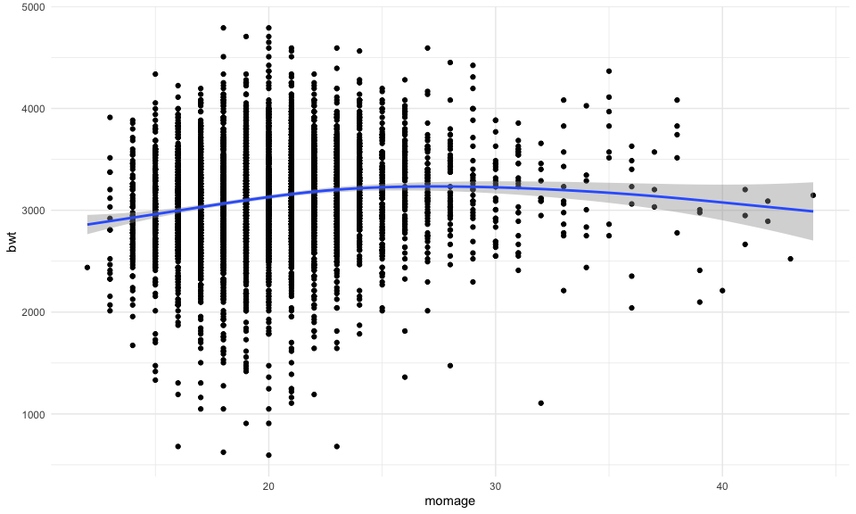

``` r
birthweight_df %>% 
  ggplot(aes(y = bwt, x = menarche)) +
  geom_point() +
  geom_smooth()
```

    ## `geom_smooth()` using method = 'gam' and formula 'y ~ s(x, bs = "cs")'

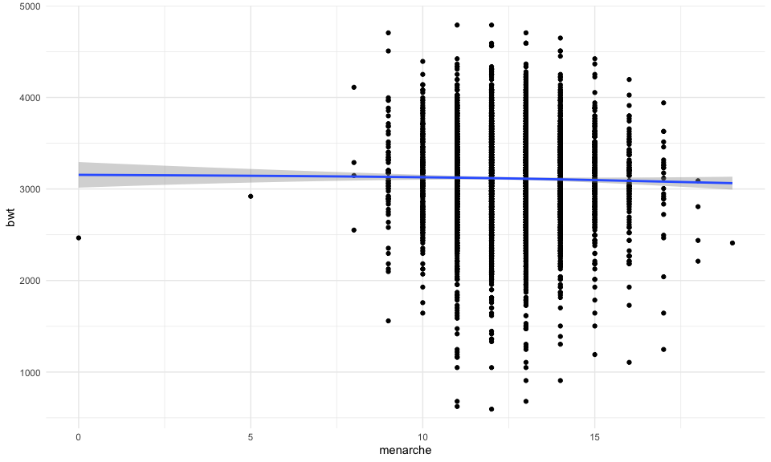

``` r
birthweight_df %>% 
  ggplot(aes(y = bwt, x = ppwt, color = ppbmi)) +
  geom_point() +
  geom_smooth()
```

    ## `geom_smooth()` using method = 'gam' and formula 'y ~ s(x, bs = "cs")'

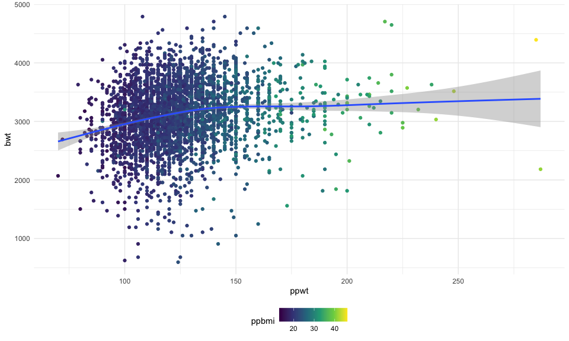

``` r
birthweight_df %>% 
  ggplot(aes(y = bwt, x = wtgain)) +
  geom_point() +
  geom_smooth()
```

    ## `geom_smooth()` using method = 'gam' and formula 'y ~ s(x, bs = "cs")'

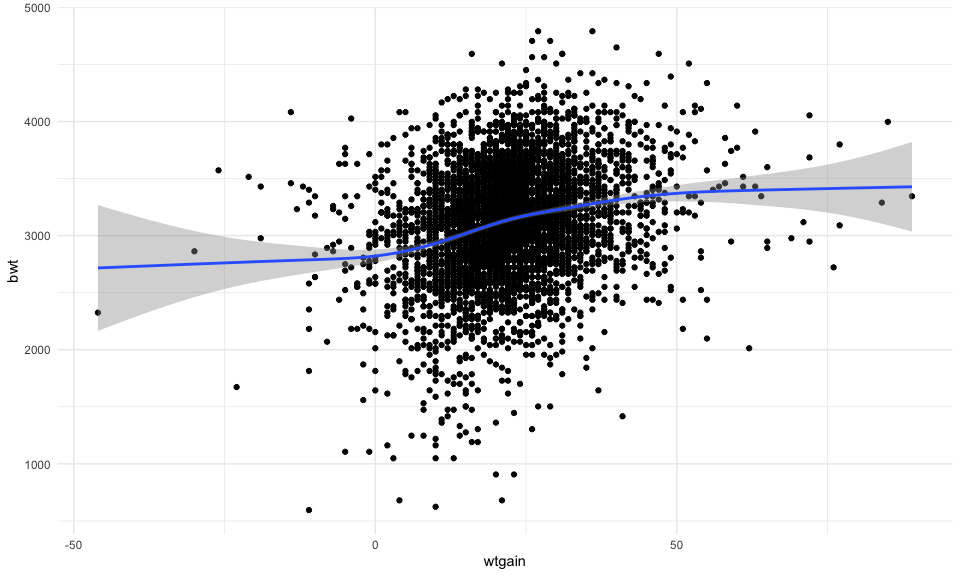

``` r
birthweight_df %>% 
  ggplot(aes(x = frace, y = bwt)) +
  geom_boxplot()
```

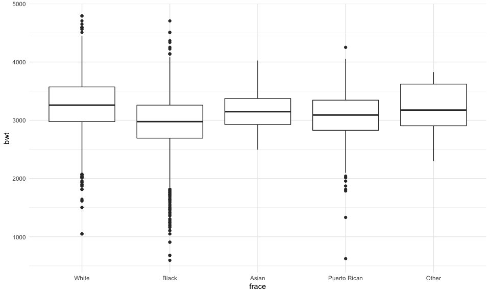

``` r
birthweight_df %>% 
  ggplot(aes(x = mrace, y = bwt)) +
  geom_boxplot()
```

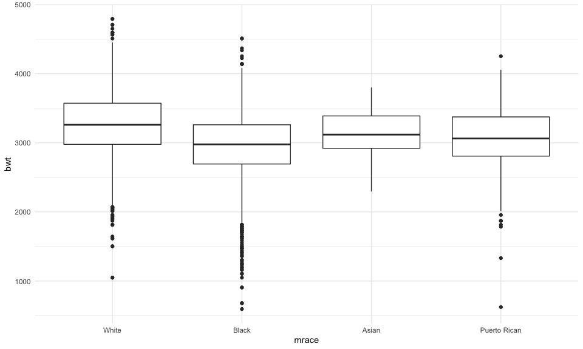

``` r
# seems like theres an association with gaweeks
birthweight_df %>% 
  ggplot(aes(y = bwt, x = gaweeks)) +
  geom_point()
```

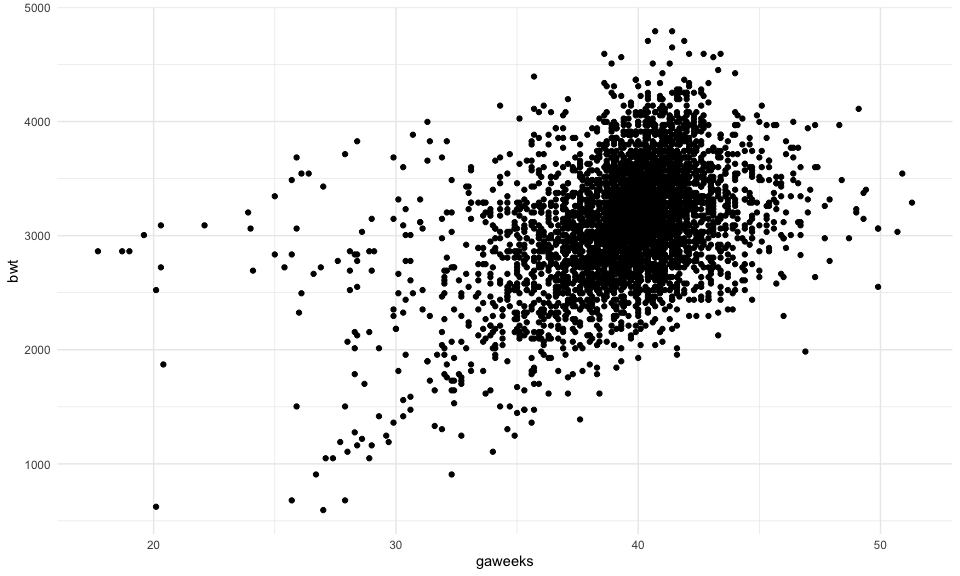

``` r
birthweight_df %>% 
  ggplot(aes(y = bwt, x = fincome)) +
  geom_point() +
  geom_smooth()
```

    ## `geom_smooth()` using method = 'gam' and formula 'y ~ s(x, bs = "cs")'

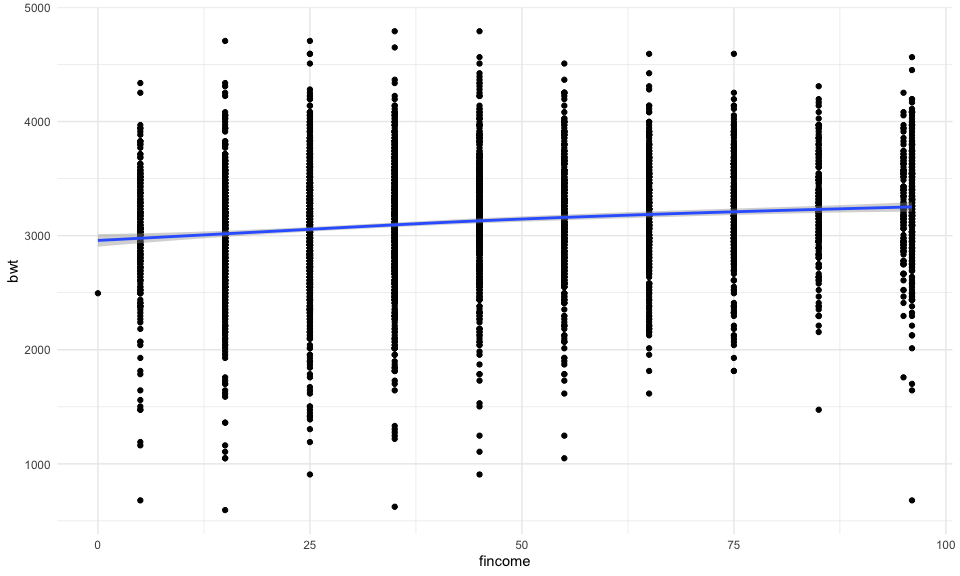

``` r
# surprisingly weak association between n cigarettes and bwt
birthweight_df %>% 
  ggplot(aes(y = bwt, x = smoken)) +
  geom_point() +
  geom_smooth()
```

    ## `geom_smooth()` using method = 'gam' and formula 'y ~ s(x, bs = "cs")'

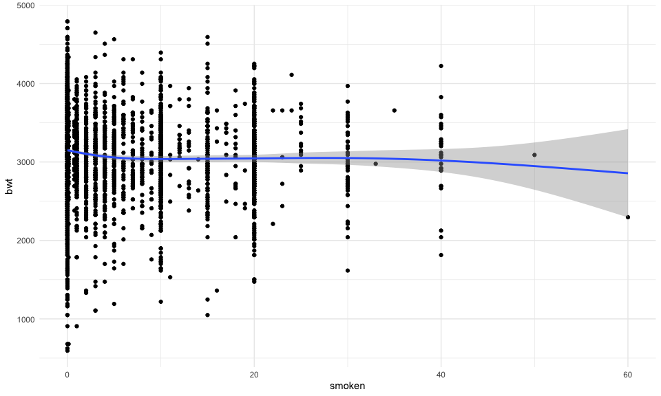

``` r
# definitely going to include baby length
birthweight_df %>% 
  ggplot(aes(y = bwt, x = blength)) +
  geom_point() +
  geom_smooth()
```

    ## `geom_smooth()` using method = 'gam' and formula 'y ~ s(x, bs = "cs")'

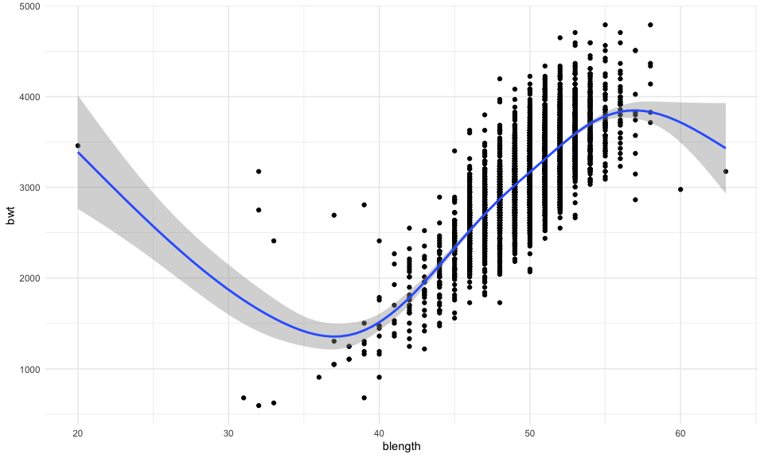

``` r
# big head babies bigger
birthweight_df %>% 
  ggplot(aes(y = bwt, x = bhead)) +
  geom_point() +
  geom_smooth()
```

    ## `geom_smooth()` using method = 'gam' and formula 'y ~ s(x, bs = "cs")'

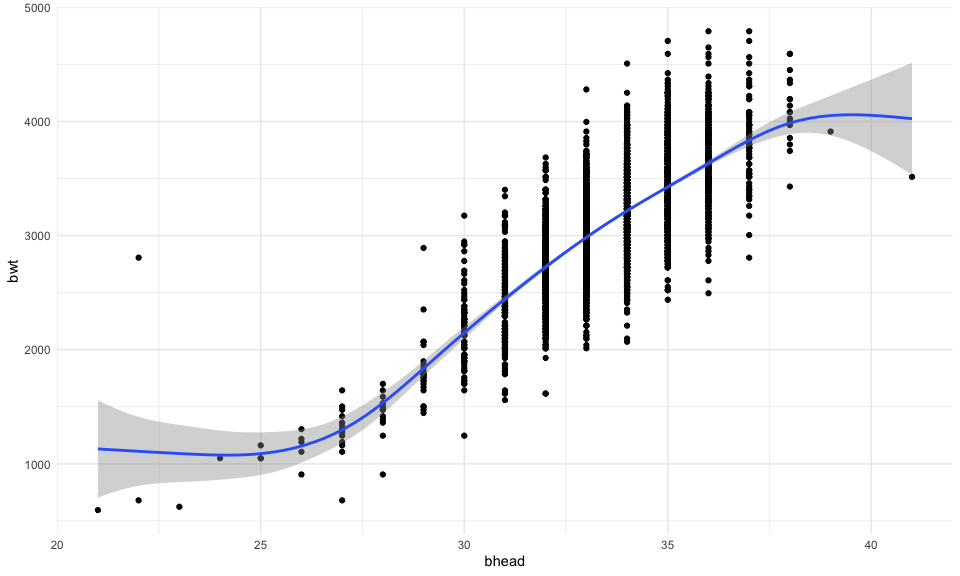

``` r
birthweight_df %>% 
  ggplot(aes(y = bwt, x = babysex)) +
  geom_point() +
  geom_smooth()
```

    ## `geom_smooth()` using method = 'gam' and formula 'y ~ s(x, bs = "cs")'

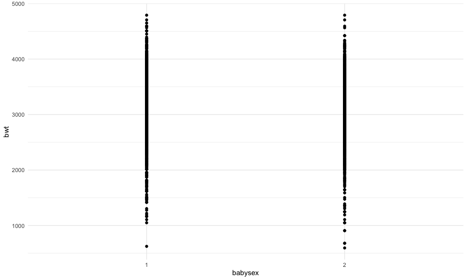

Based on my exploratory analysis of the relationship between birthweight
and the different recorded variables, I will build a model in which
weight at birth depends on the size of the baby’s head (`bhead`), the
length of the baby (`blength`), and the gestational age in weeks
(`gaweeks`), as there seems to be some sort of linear relationship
between birthweight and variable.

``` r
model_one = 
  lm(bwt ~ bhead + blength + gaweeks, data = birthweight_df)

summary(model_one)
```

    ## 
    ## Call:
    ## lm(formula = bwt ~ bhead + blength + gaweeks, data = birthweight_df)
    ## 
    ## Residuals:
    ##      Min       1Q   Median       3Q      Max 
    ## -1105.73  -191.84   -10.99   178.74  2596.80 
    ## 
    ## Coefficients:
    ##              Estimate Std. Error t value Pr(>|t|)    
    ## (Intercept) -6195.572     96.352 -64.301   <2e-16 ***
    ## bhead         138.853      3.531  39.325   <2e-16 ***
    ## blength        81.643      2.084  39.177   <2e-16 ***
    ## gaweeks        14.601      1.509   9.677   <2e-16 ***
    ## ---
    ## Signif. codes:  0 '***' 0.001 '**' 0.01 '*' 0.05 '.' 0.1 ' ' 1
    ## 
    ## Residual standard error: 286.1 on 4338 degrees of freedom
    ## Multiple R-squared:  0.6881, Adjusted R-squared:  0.6879 
    ## F-statistic:  3190 on 3 and 4338 DF,  p-value: < 2.2e-16

``` r
model_one %>% 
  broom::tidy() %>% 
  knitr::kable()
```

| term        |   estimate | std.error |  statistic | p.value |
|:------------|-----------:|----------:|-----------:|--------:|
| (Intercept) | -6195.5719 | 96.352428 | -64.301149 |       0 |
| bhead       |   138.8529 |  3.530918 |  39.324880 |       0 |
| blength     |    81.6433 |  2.083950 |  39.177199 |       0 |
| gaweeks     |    14.6008 |  1.508757 |   9.677368 |       0 |

``` r
# plot predicted / fitted values against residuals

birthweight_df %>% 
  add_predictions(model_one) %>% 
  add_residuals(model_one) %>% 
  ggplot(aes(x = resid, y = pred)) + 
  geom_point()
```

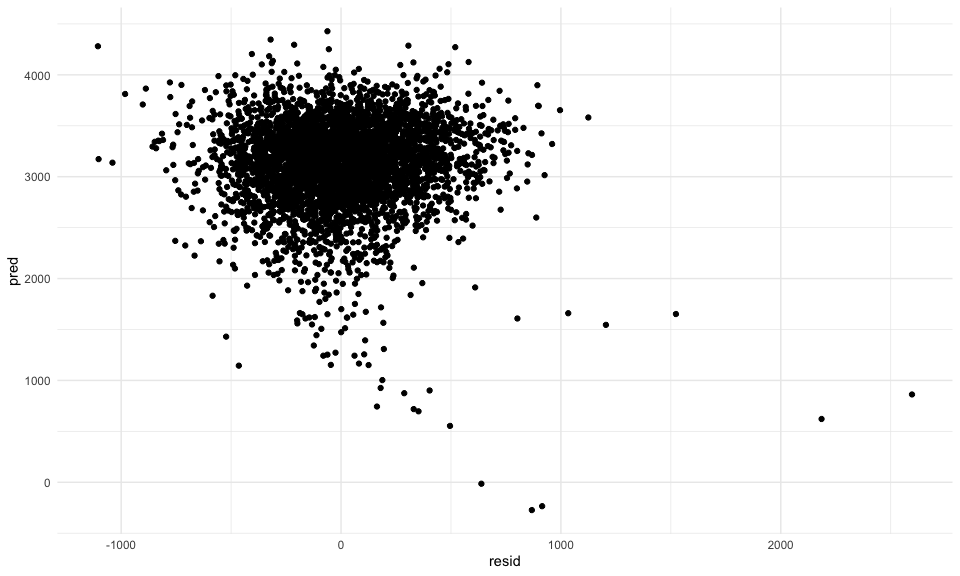

#### Defining Alternative Models

``` r
alt_model_one =
  lm(bwt ~ blength + gaweeks, data = birthweight_df)

alt_model_two = 
  lm(bwt ~ bhead + blength + babysex + bhead*blength + blength*babysex + bhead*babysex + bhead*blength*babysex, data = birthweight_df)
```

#### Cross Validation of the Three Models

``` r
print(rmse(model_one, birthweight_df))
```

    ## [1] 286.0023

``` r
print(rmse(alt_model_one, birthweight_df))
```

    ## [1] 333.1023

``` r
print(rmse(alt_model_two, birthweight_df))
```

    ## [1] 287.4692

Cross validate the three models:

``` r
bwt_cv_df =
  crossv_mc(birthweight_df, 1000) %>% 
  mutate(
    train = map(train, as_tibble),
    test = map(test, as_tibble)
  )

bwt_cv_df =
  bwt_cv_df %>% 
  mutate(
    model_one = map(.x = train, ~lm(bwt ~ bhead + blength + gaweeks, data = .x)),
    alt_model_one = map(.x = train, ~lm(bwt ~ blength + gaweeks, data = .x)),
    alt_model_two = map(.x = train, ~lm(bwt ~ bhead + blength + babysex + bhead*blength + blength*babysex + bhead*babysex + bhead*blength*babysex, data = .x))
  ) %>% 
  mutate(
    rmse_model_one = map2_dbl(.x = model_one, .y = test, ~rmse(model = .x, data = .y)),
    rmse_alt_one = map2_dbl(.x = alt_model_one, .y = test, ~rmse(model = .x, data = .y)),
    rmse_alt_two = map2_dbl(.x = alt_model_two, .y = test, ~rmse(model = .x, data = .y))
  )

bwt_cv_df %>% 
  select(starts_with("rmse")) %>% 
  pivot_longer(
    rmse_model_one:rmse_alt_two,
    names_to = "model",
    values_to = "rmse",
    names_prefix = "rmse_"
  ) %>% 
  ggplot(aes(x = model, y = rmse)) +
  geom_boxplot()
```

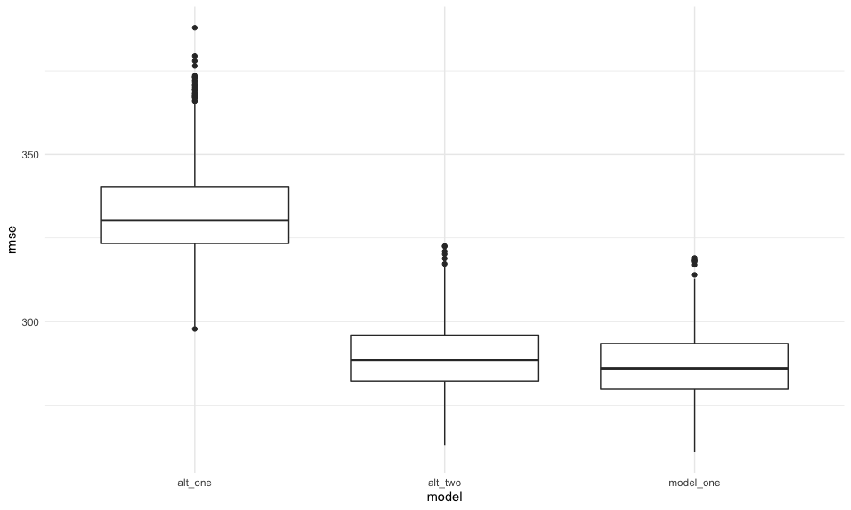

Based on the root mean squared estimates of the raw models as well as
the root mean squared estimates generated by cross validation, the first
model, which regresses birthweight on `bhead`, `blength`, and `gaweeks`,
is the best fit. However, model\_one, my proposed model, and the second
alternative model (which regresses on `bhead`, `blength`, and `babysex`
in place of `gaweeks`) have very similar RMSE values and are likely
similarly good models.

# Problem 2: Bootstrap Central Park Data

``` r
weather_df = 
  rnoaa::meteo_pull_monitors(
    c("USW00094728"),
    var = c("PRCP", "TMIN", "TMAX"), 
    date_min = "2017-01-01",
    date_max = "2017-12-31") %>%
  mutate(
    name = recode(id, USW00094728 = "CentralPark_NY"),
    tmin = tmin / 10,
    tmax = tmax / 10) %>%
  select(name, id, everything())
```

``` r
boot_sample = function(df){
  
  sample_frac(df, size = 1, replace = TRUE)
}

boot_strap_df = 
  tibble(
    bstrap_number = 1:5000, 
    bstrap_sample = rerun(5000, boot_sample(weather_df))
  )

bootstrap_results =
  boot_strap_df %>% 
  mutate(
   models = map(.x = bstrap_sample, ~lm(tmax ~ tmin, data = .x))
   )
  
beta_df =
  bootstrap_results %>%
  mutate(
    results = map(models, broom::tidy)
  ) %>% 
  select(bstrap_number, results) %>% 
  unnest(results) %>%
  pivot_wider(
    names_from = term,
    values_from = c(estimate, std.error, statistic, p.value)
  ) %>% 
  janitor::clean_names() %>% 
  mutate(
    log_b0b1 = log(estimate_intercept * estimate_tmin)
  )

confidence_interval_beta = quantile(beta_df$log_b0b1, probs = c(0.025, 0.975))

rsq_df =
  bootstrap_results %>% 
  mutate(
    results = map(models, broom::glance)
  ) %>% 
  select(bstrap_number, results) %>% 
  unnest(results)

confidence_interval_rsq = quantile(rsq_df$r.squared, probs = c(0.025, 0.975))
```

``` r
  beta_df %>% 
  ggplot(aes(x = log_b0b1)) +
  geom_histogram()
```

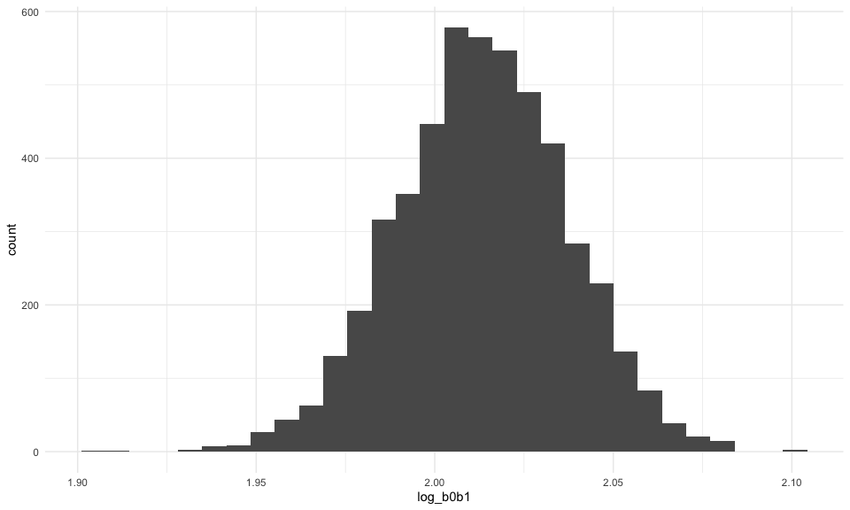

``` r
  rsq_df %>% 
  ggplot(aes(x = r.squared)) +
  geom_histogram()
```

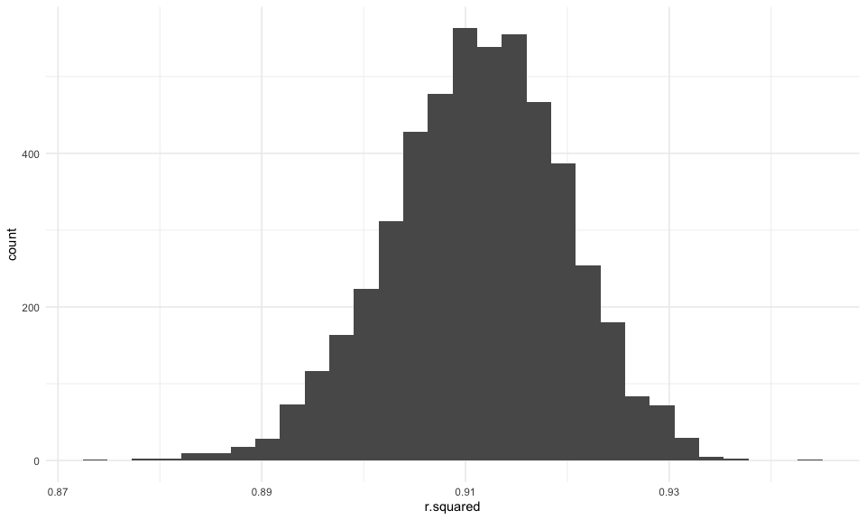

The plots of the distributions of the R^2 and log(B0B1) values show
that, using 5000 bootstrap samples, the distributions of each parameter
are approximately normal, though both distributions are slightly left
skewed.

The 95% confidence interval for log(β̂ 0∗β̂1) across 5000 bootstrap
samples is (1.965, 2.059). The 95% confidence interval for r2 across
5000 bootstrap samples is (0.894, 0.928)
